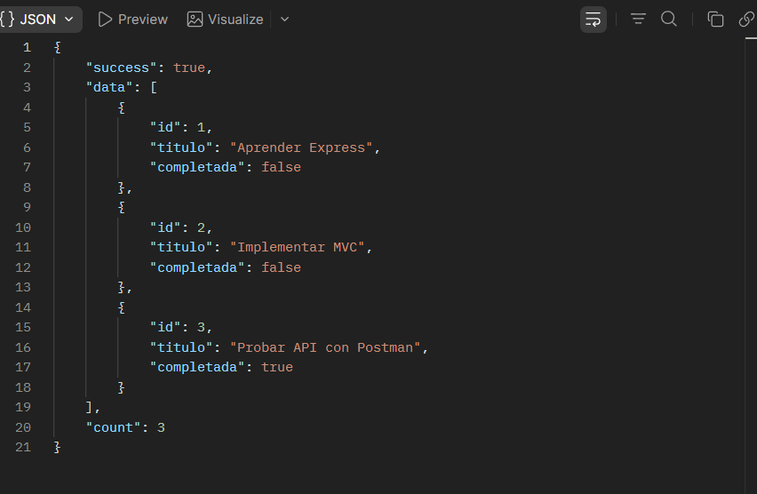
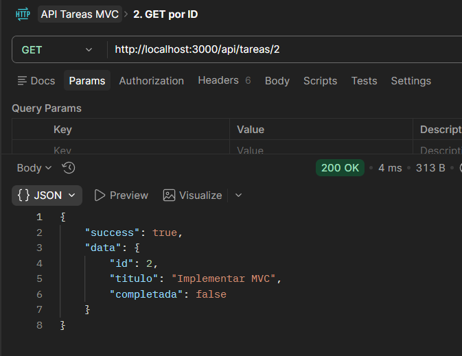
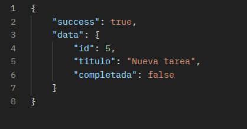
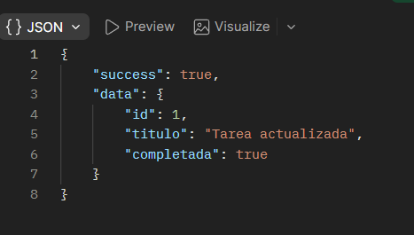
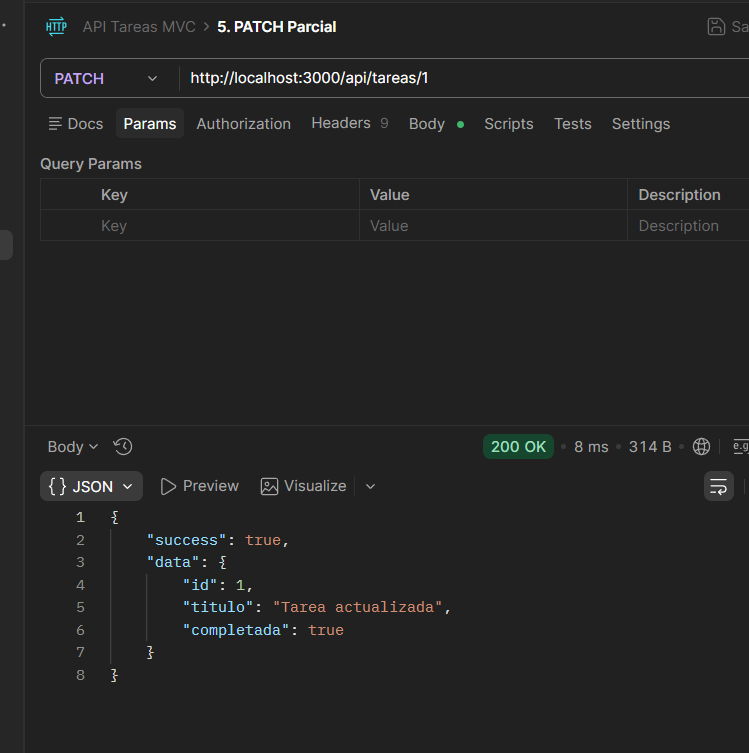
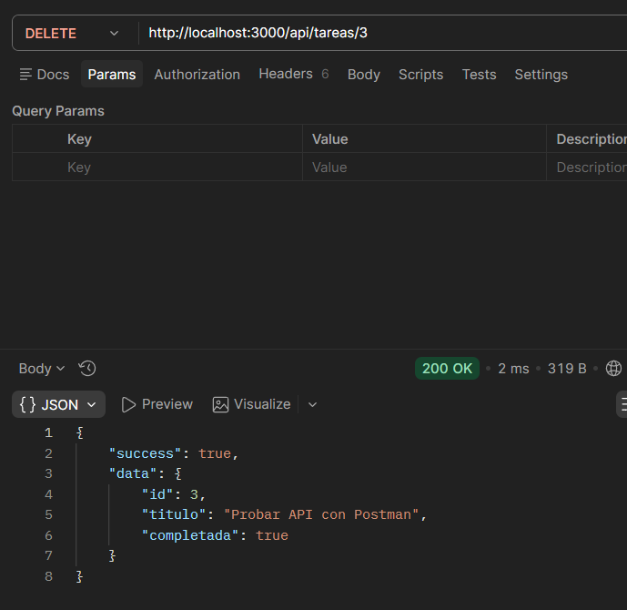
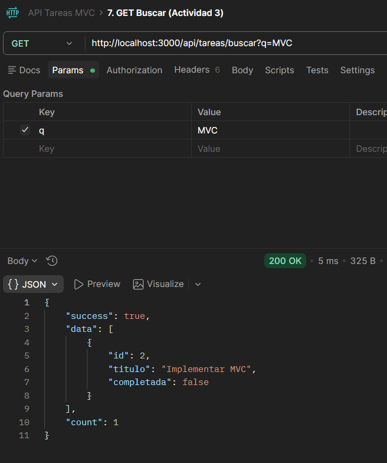
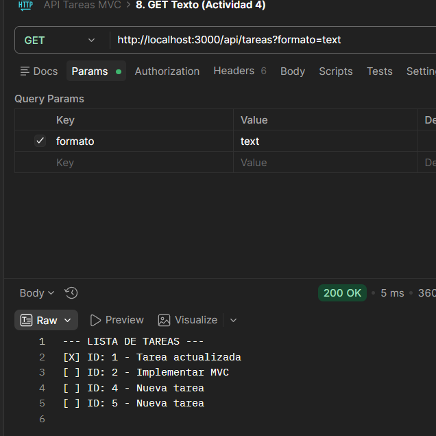

# 📝 Práctica de Laboratorio: API REST con Express - Gestión de Tareas (MVC)

## 📋 Descripción del Proyecto
Esta es una API RESTful desarrollada con Node.js y Express para gestionar un recurso de "Tareas". La aplicación permite crear, leer, actualizar y eliminar tareas utilizando una lista en memoria para la persistencia de datos. Todo el proyecto está estructurado siguiendo el patrón de diseño MVC (Modelo-Vista-Controlador) para separar la lógica de negocio, el enrutamiento y el manejo de peticiones.

## 🏗️ Estructura del Proyecto

api-tareas-mvc/
├── src/
│   ├── models/
│   │   └── tarea.model.js       # Modelo de datos y lógica
│   ├── controllers/
│   │   └── tarea.controller.js  # Controlador con métodos HTTP
│   ├── routes/
│   │   └── tarea.routes.js      # Definición de endpoints
│   └── app.js                   # Configuración de Express
├── package.json
├── server.js                    # Punto de entrada
└── http-test-collection.json    # Colección de pruebas

## ⚙️ Instrucciones de Instalación

1. Clona este repositorio en tu máquina local.
2. Abre una terminal en la raíz del proyecto.
3. Instala las dependencias necesarias ejecutando:

npm install

## 🚀 Cómo Ejecutar

Para iniciar el servidor en modo de desarrollo (con auto-recarga gracias a Nodemon), ejecuta:

npm run dev

El servidor estará corriendo en: http://localhost:3000

---

## 📡 Lista de Endpoints Disponibles

| Método | Endpoint | Descripción | Body (JSON) |
|---|---|---|---|
| **GET** | `/api/tareas` | Obtiene todas las tareas (soporta parámetro `?formato=text`). | - |
| **GET** | `/api/tareas/buscar?q=` | Busca tareas por título (case insensitive - Actividad Extra). | - |
| **GET** | `/api/tareas/:id` | Obtiene una tarea específica por ID. | - |
| **POST** | `/api/tareas` | Crea una nueva tarea con ID autoincremental. | `{"titulo": "String", "completada": Boolean}` |
| **PUT** | `/api/tareas/:id` | Actualiza una tarea completamente. | `{"titulo": "String", "completada": Boolean}` |
| **PATCH**| `/api/tareas/:id` | Actualiza parcialmente una tarea. | `{"completada": Boolean}` |
| **DELETE**|`/api/tareas/:id` | Elimina una tarea por su ID. | - |

---

## 🧠 Informe Breve y Justificación Técnica

### 1. Estructura MVC Implementada
En esta práctica se implementó el patrón de diseño adaptado para una API REST, separando las responsabilidades de la siguiente manera:

* **Modelo (`tarea.model.js`):** Se encarga exclusivamente de la estructura de los datos y la lógica de negocio. Administra el arreglo en memoria, genera los IDs autoincrementales y contiene las funciones para buscar y filtrar. No tiene conocimiento del protocolo HTTP.
* **Controlador (`tarea.controller.js`):** Actúa como intermediario. Recibe las peticiones de Express, extrae los datos del cliente, llama al Modelo para procesar la información, y formula una respuesta en formato JSON con el código de estado correspondiente.
* **Rutas (`tarea.routes.js`):** Define los endpoints (URLs) de la API y conecta cada método HTTP con su función correspondiente dentro del Controlador.

*(Nota: En esta API REST, la "Vista" está representada por las respuestas estructuradas en formato JSON que devuelve el servidor, no por una interfaz gráfica).*

### 2. Diferencia entre PUT y PATCH

* **PUT (Reemplazo Total):** Se utiliza para reemplazar un recurso por completo. El cliente debe enviar la representación completa del recurso. Si se omite un campo, conceptualmente ese campo se sobrescribe como nulo o vacío.
* **PATCH (Modificación Parcial):** Se utiliza para aplicar modificaciones parciales. El cliente solo necesita enviar los campos específicos que desea alterar (ej. cambiar solo el estado a `completada: true`), manteniendo el resto de las propiedades intactas.

### 3. Códigos de Estado HTTP Utilizados
Se implementaron los siguientes códigos para cumplir con las buenas prácticas RESTful:

* **200 OK**: Utilizado en GET, PUT, PATCH y DELETE para indicar que la solicitud se procesó correctamente.
* **201 Created**: Exclusivo del método POST para indicar la creación exitosa de un nuevo recurso en el servidor.
* **400 Bad Request**: Utilizado para la validación de datos (ej. si falta el campo obligatorio "titulo" al crear).
* **404 Not Found**: Se dispara cuando el cliente intenta interactuar con un ID de tarea que no existe.
* **500 Internal Server Error**: Implementado en los bloques catch de los controladores para manejar fallos inesperados.

---

## 🧪 Pruebas y Colección

Se incluye en la raíz de este repositorio el archivo `http-test-collection.json`. Este archivo contiene la colección completa de requerimientos HTTP lista para importar en Postman y evaluar todos los endpoints, incluyendo validación de errores y funcionalidades extra.

---

## 📸 Capturas de Pantalla (Postman)

**1. Obtener todas las tareas (GET)** 

**2. Obtener tarea por ID (GET)** 

**3. Crear una nueva tarea (POST)** 

**4. Actualización Completa (PUT)** 

**5. Actualización Parcial (PATCH)** 

**6. Eliminar tarea (DELETE)** 

**7. Validación de Error (POST sin título - 400 Bad Request)** 

**8. Funcionalidad Extra (Búsqueda por Título)** 

**9. Funcionalidad Extra (Formato Texto)** 